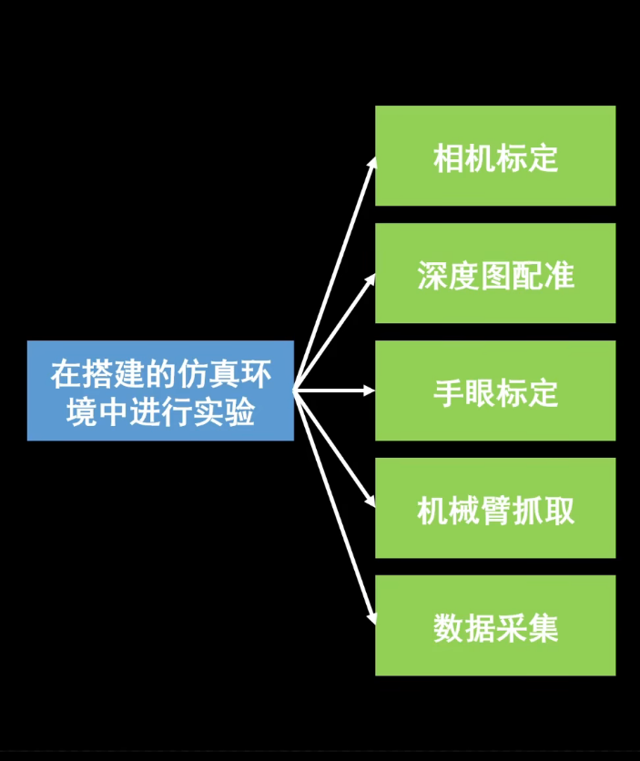

[***搭建好啦！记录了一下踩坑过程***](https://blog.csdn.net/qq_38620941/article/details/125321347?csdn_share_tail=%7B%22type%22%3A%22blog%22%2C%22rType%22%3A%22article%22%2C%22rId%22%3A%22125321347%22%2C%22source%22%3A%22qq_38620941%22%7D&ctrtid=UMKww)

[***github***](https://github.com/Suyixiu/robot_sim)

|总览|
|:--:|
||

## 一.相机标定

1. 自己计算内参
```sh
# gazebo 加载 相机与靶
roslaunch robot_sim camera_calibration.launch
# 移动标定板 保存图片
rosrun robot_sim camera_calibration
# 计算内参
cd ~/your_catkin_ws/src/robot_sim/experiment/camera_calibration/scripts
python3 camera_calibration.py
# 查看 计算得到的参数
python3 check.py
```
2. 使用ROS自带的标定包来计算参数
```sh
# 使用ROS自带的标定包来进行 实时的标定
rosrun camera_calibration cameracalibrator.py --size 7x6 --square 0.01 image:=/camera/rgb/image_raw camera:=/camera/rgb     #RGB相机
rosrun camera_calibration cameracalibrator.py --size 7x6 --square 0.01 image:=/camera/ir/image_raw camera:=/camera/ir       #IR相机
# 解压标定后的文件
mkdir calibrationdata
cd calibrationdata
tar -xzvf calibrationdata.tar.gz
```

## 二.深度图配准

```sh
# 计算配准矩阵
cd ~/your_catkin_ws/src/robot_sim/experiment/depth_image_registration/scripts
python3 depth_image_registration.py
# 查看 配准前与配准后的区别
cd ../src
g++ ./depth_image_registration.cpp -o depth_image_registration $(pkg-config --cflags --libs opencv4)
./depth_image_registration
```

## 三.手眼标定

```sh
# 机器臂 moveit + gazebo 启动
roslaunch yixiuge_ur10_moveit_config yixiuge_ur_moveit.launch
# rviz aruco 手眼标定
# 启动 easy_handeye 的 calibrate.launch，进行手眼标定计算
roslaunch robot_sim hand_eye_calibration.launch
# 必须订阅 /aruco_tracker/result ✅ 真相：aruco_ros 是 “懒发布”（Lazy Publisher）！
rqt_image_view
```

**手眼标定完成点击save后数据会保存在:**
- [easy_handeye_eye_on_hand.yaml](../../.ros/easy_handeye/easy_handeye_eye_on_hand.yaml)

```sh
# 机器臂 moveit + gazebo 启动
roslaunch yixiuge_ur10_moveit_config yixiuge_ur_moveit.launch
# 查看真实 urdf 里面的 tf
rosrun tf tf_echo yixiuge_ee_link camera_rgb_optical_frame
# 观察标定的结果
# 启动 easy_handeye 的 publish.launch，发布标定结果
# 标定好的“相机到末端”的变换关系发布到 ROS 系统中，供其他模块使用和验证
roslaunch robot_sim hand_eye_calibration_result.launch
```


## 四.机器臂抓取
```sh
# 启动基本环境
roslaunch robot_sim grasp_world.launch 
# 顺序加载物体
source devel/setup.bash
cd src/robot_sim/experiment/grasp/scripts
python3 spawn_objects.py
```
***1. 几何法***
```sh
# mask
rosrun robot_sim geometric_method_grasp
```

***2. 机器学习方法 —— GPD***
```sh
roslaunch robot_sim gpd_run.launch type:=2 topic:=/cloud_sample
rosrun robot_sim GPD_method_grasp
```
```sh
# 验证你的GPD是否安装正确
catkin_make --only-pkg-with-deps robot_sim
roslaunch robot_sim gpd_run.launch type:=2 topic:=/cloud_sample
roslaunch robot_sim test_gpd.launch
```

## 五.数据采集

```sh
# 启动基本环境
roslaunch robot_sim grasp_world.launch 
# 顺序加载物体
source devel/setup.bash
cd src/robot_sim/experiment/grasp/scripts
python3 spawn_objects.py
```

```sh
# 采集数据
rosrun robot_sim data_collection
```
